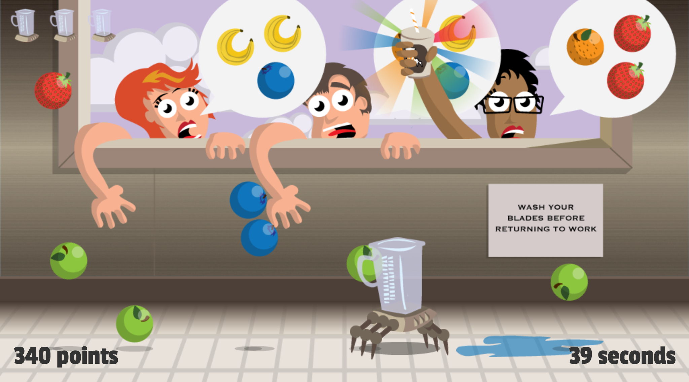

# Smoothie Operator


> In the not-so distant future where food trucks are in such high demand that they needed to take to the skies, people do whatever they can to place orders for smoothies. Whether it's by jetpack, grappling hooks or their natural ability to fly, people are placing a lot of orders. Your job, as this flying food truck's only robotic blender, is to fulfill as many orders as you can before too many customers get angry and leave.

## Credits

- Designer - **Rich Leonardo** of [Forge Ahead Studios](http://forgeaheadstudios.com/)
- Audio SFX/Music - **Oliver Getz**
- Developer - **Michael Leonardo** of [Forge Ahead Studios](http://forgeaheadstudios.com/)
- Developer - **Scott Doxey** of [Robot Monster Loves You](http://robotmonsterlovesyou.com/)
- Developer - **Travis Beebe**

## Screenshots





## Local Development Server

```bash
$ python -m SimpleHTTPServer
```
